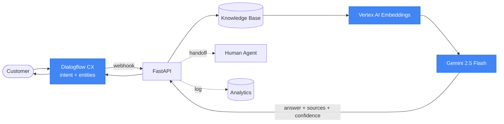

# 🤖 Enterprise Customer Support AI

[](https://github.com/962003/conversational-ai-assistant/actions/workflows/ci.yml)

> A mini **Google Contact Center AI** — **Dialogflow CX + Gemini + Webhook + Knowledge Base + Analytics**.

An enterprise-grade conversational assistant that automates repetitive customer
support: order status, refunds, pricing, product info, and troubleshooting — with
**grounded** answers (no hallucinations) and **human handoff** when it can't help.

**📄 [Solution Architecture](docs/solution-architecture.md) · [Business Impact](docs/business-impact.md) · [Conversational / Journey Design](docs/customer-journey-design.md)** · [Diagrams](docs/architecture-diagram.md) · [Dialogflow CX setup](dialogflow/README.md) · [Deployment](deployment/)

---

## 🎯 What this demonstrates

This repo is a **Conversational AI solution**, evaluated on conversational/Cloud
competencies — not UI polish. Each links to the evidence:

| Competency | Status | Where |
|------------|--------|-------|
| **Conversational design** (flows, pages, routes, fallbacks) | ✅ | [provision_agent.py](dialogflow/provision_agent.py) · [customer-journey-design.md](docs/customer-journey-design.md) |
| **Intent modeling** (6 intents, training phrases) | ✅ | [intents.json](dialogflow/agent_export/intents.json) |
| **Entity extraction** (regex + map entities, annotated) | ✅ | [entities.json](dialogflow/agent_export/entities.json) · provision_agent.py |
| **Slot filling** (required params, reprompts, no-input) | ✅ | [customer-journey-design.md](docs/customer-journey-design.md) |
| **Webhook architecture** (CX `WebhookRequest/Response`) | ✅ | [webhook.py](backend/app/routers/webhook.py) |
| **Dialogflow CX integration** (live `detect_intent`) | ✅ | [cx_client.py](backend/app/cx_client.py) |
| **Cloud deployment** (Cloud Run + CI/CD) | ✅ | [deployment/](deployment/) · [.github/workflows](.github/workflows) |
| **Business workflows** (order lookup, refund, escalation+ticket) | ✅ | [customer-journey-design.md](docs/customer-journey-design.md) |
| **Customer use cases** (6 verticals) | ✅ | [business-impact.md](docs/business-impact.md) |
| **Contact Center AI** alignment | ✅ | [solution-architecture.md](docs/solution-architecture.md) |
| **Production architecture** (Vertex AI, Pub/Sub, BigQuery target) | 📐 designed | [architecture-diagram.md](docs/architecture-diagram.md) |
| **Voice AI** (CCAI telephony / STT-TTS) | 🔜 roadmap | [customer-journey-design.md](docs/customer-journey-design.md#voice--contact-center-ai) |

Legend: ✅ implemented · 📐 designed/diagrammed · 🔜 roadmap (honestly scoped).

## 🎯 Problem

Support teams spend most of their time answering the same questions. Customers wait
in queues for answers that already exist in the docs.

## 💡 Solution

A conversational AI assistant that detects intent with **Dialogflow CX**, retrieves
the right policy from a **knowledge base**, and generates a **grounded answer with
Gemini** — escalating to a human only when needed, and logging everything for
**analytics**.

```
User → Dialogflow CX (intent + entities) → Webhook (FastAPI)
     → Knowledge Base (retrieve) → Gemini (grounded answer) → User
```

> This is a **conversational AI solution**, not a RAG demo: Dialogflow CX does the
> NLU and conversation, and calls the FastAPI webhook for grounded fulfillment.
> The CX agent is provisioned **as code** and the demo can run **through CX**
> end-to-end (toggle in the UI), or directly against the pipeline.

## 🏗️ Architecture



More diagrams (sequence + deployment) in
[`docs/architecture-diagram.md`](docs/architecture-diagram.md) · prose in
[`docs/architecture.md`](docs/architecture.md).

## ✨ Features

| | Feature | Where |
|---|---------|-------|
| ✅ | **Dialogflow CX agent as code** — provisions intents, entities, webhook, flow routes | [`dialogflow/provision_agent.py`](dialogflow/provision_agent.py) |
| ✅ | **Live CX path** — `/cx/detect-intent` drives a real agent; frontend toggle | [`backend/app/cx_client.py`](backend/app/cx_client.py) |
| ✅ | **Webhook fulfillment** — returns **answer + sources + confidence** | [`backend/app/routers/webhook.py`](backend/app/routers/webhook.py) |
| ✅ | **FastAPI** backend — `/chat`, `/cx/detect-intent`, `/dialogflow/webhook`, `/knowledge/search`, `/analytics`, `/ticket` | [`backend/`](backend/) |
| ✅ | **Gemini 2.5 Flash** grounded generation | [`backend/app/gemini_client.py`](backend/app/gemini_client.py) |
| ✅ | **Vector retrieval** — Vertex AI / Gemini embeddings + cosine (TF-IDF fallback) | [`backend/app/embeddings.py`](backend/app/embeddings.py) |
| ✅ | **Knowledge base** — Markdown → sectioned chunks, cached embeddings | [`knowledge_base/`](knowledge_base/) |
| ✅ | **Analytics dashboard** — intents, KB hits, containment, escalations | [`frontend/dashboard.html`](frontend/dashboard.html) |
| ✅ | **Human handoff** — ticket creation | `human_agent` intent + `/ticket` |
| ✅ | **Sentiment analysis** per turn | Gemini + fallback |
| ✅ | **Multi-language** ready | CX language codes + Gemini |
| ✅ | **Graceful degradation** — runs with no API key | fallbacks |

## 🧠 Anti-hallucination (why enterprises care)

Gemini is instructed to answer **only** from retrieved context. If the answer
isn't there, it replies:

> *"I couldn't find information about that in our knowledge base. Would you like me
> to connect you with a human agent?"*

## 🚀 Quickstart (local)

### Backend
```bash
cd backend
python -m venv .venv && source .venv/bin/activate
pip install -r requirements.txt

# Optional: enable real Gemini answers
cp ../.env.example .env        # then add GEMINI_API_KEY

uvicorn app.main:app --reload   # → http://localhost:8000  (docs at /docs)
```
> No API key? It still runs — using keyword intent detection and extractive
> answers, clearly labeled as demo fallbacks.

### Frontend
```bash
cd frontend
python -m http.server 5500      # → http://localhost:5500
```
Open the **Chat** and **Analytics** tabs. `frontend/config.js` points to the
backend (defaults to `localhost:8000`).

### Tests
```bash
cd backend && source .venv/bin/activate
pip install pytest httpx
pytest -q                       # 6 passing smoke tests
```

## 🔎 Retrieval modes

Retrieval auto-selects a backend at startup (check `GET /health` →
`retrieval_method`):

| Mode | When | How |
|------|------|-----|
| **vector** | embeddings reachable | Vertex AI / Gemini embeddings + cosine similarity. Asymmetric `RETRIEVAL_DOCUMENT` / `RETRIEVAL_QUERY` task types. Chunk vectors cached to `backend/data/kb_embeddings.json` (keyed by content+model). |
| **keyword** | no credentials | TF-IDF over sectioned chunks — zero-dependency fallback. |

Enable vector retrieval one of two ways (in `backend/.env`):

```bash
# A) Gemini Developer API (simplest)
GEMINI_API_KEY=your_key
EMBEDDING_MODEL=text-embedding-004     # or gemini-embedding-001

# B) Vertex AI (service account / ADC)
USE_VERTEX=true
GOOGLE_CLOUD_PROJECT=your-project
GOOGLE_CLOUD_LOCATION=us-central1
# then: gcloud auth application-default login
```

`USE_VERTEX` switches **both** embeddings and Gemini generation to the Vertex AI
backend through the same `google-genai` client. Each `/chat` response and
`/knowledge/search` result reports which `method` produced it.

## 🗣️ Run through Dialogflow CX (the full path)

By default the UI talks to `/chat` (Direct). Flip the **Dialogflow CX** toggle to
route through a real CX agent:

```
User → CX (detect_intent) → CX calls our webhook → KB + Gemini → grounded answer
```

1. Provision the agent as code:
   ```bash
   pip install google-cloud-dialogflow-cx
   gcloud auth application-default login
   python dialogflow/provision_agent.py \
     --project YOUR_PROJECT --location global \
     --webhook-url https://YOUR-BACKEND/dialogflow/webhook
   ```
2. Put the printed `DIALOGFLOW_PROJECT/LOCATION/AGENT_ID` in `backend/.env`.
3. Restart the backend → `GET /cx/status` shows `cx_enabled: true`, and the UI
   toggle goes green. `POST /cx/detect-intent` now drives the live agent.

If CX isn't configured, the toggle still works — it transparently falls back to
`/chat` and tells the user. See [`dialogflow/README.md`](dialogflow/README.md).

## 🧪 Demo

Try these in the chat (or the `/docs` Swagger UI):

| You say | What happens |
|---------|--------------|
| "What is your refund policy?" | `refund_policy` → grounded answer from `refund_policy.md` |
| "How much does the Pro plan cost?" | `pricing` → plan table |
| "Where is my order 12345?" | `order_status` → extracts `order_id`, shipping info |
| "Tell me about Acme Voice Gateway" | `product_information` → product details |
| "I want to talk to a human" | `human_agent` → ticket form → ticket created |

The **Analytics** tab updates live: total conversations, containment rate, top
intents, KB hits, escalations.

## ☁️ Deployment

| Target | File |
|--------|------|
| Google **Cloud Run** (recommended for CCAI) | [`deployment/cloud-run.md`](deployment/cloud-run.md) |
| **Render** | [`deployment/render.yaml`](deployment/render.yaml) |
| **Railway** | [`deployment/railway.json`](deployment/railway.json) |
| Frontend → **Vercel / Netlify** | static, set `config.js` to backend URL |

After deploying the backend, point the Dialogflow CX webhook at
`https://YOUR-BACKEND/dialogflow/webhook` (see [dialogflow/README.md](dialogflow/README.md)).

## 🔌 Connecting Dialogflow CX

Step-by-step (create agent, intents, entities, webhook, fulfillment, handoff page)
in [`dialogflow/README.md`](dialogflow/README.md). Importable training phrases and
entity definitions live in [`dialogflow/agent_export/`](dialogflow/agent_export/).

## 📁 Repository structure

```
conversational-ai-assistant/
├── README.md
├── backend/                # FastAPI + Gemini + retrieval + analytics
│   ├── app/
│   │   ├── main.py
│   │   ├── service.py      # intent → retrieve → ground → log
│   │   ├── gemini_client.py
│   │   ├── embeddings.py   # Vertex AI / Gemini embeddings
│   │   ├── knowledge_base.py  # vector search + TF-IDF fallback
│   │   ├── cx_client.py    # Dialogflow CX detect_intent client
│   │   ├── analytics.py
│   │   ├── database.py
│   │   └── routers/        # chat, cx, webhook, knowledge, analytics
│   └── tests/
├── dialogflow/
│   ├── provision_agent.py  # build the CX agent via the SDK
│   ├── README.md
│   └── agent_export/       # importable intents + entities
├── frontend/               # chat widget (Direct/CX toggle) + analytics dashboard
├── knowledge_base/         # refund_policy, pricing, shipping, products, faq (.md)
├── deployment/             # Cloud Run / Render / Railway
├── docs/                   # solution-architecture, business-impact,
│                           # customer-journey-design, architecture-diagram, architecture
└── screenshots/
```

## 🛣️ Roadmap to full CCAI
- ✅ Vector retrieval via **Vertex AI / Gemini embeddings** — next: **Vertex AI
  Vector Search** for large corpora
- **Vertex AI Gemini** with service-account auth (`USE_VERTEX=true`)
- **CCAI telephony** (voice) channel
- CRM ticketing via real connectors (Zendesk/Salesforce)
- Analytics → **BigQuery** + Looker Studio

## 🧰 Tech stack
**Dialogflow CX**, **Gemini 2.5 Flash**, **FastAPI**, **Python 3.12**, SQLite,
vanilla JS frontend. Deployable to Cloud Run / Render / Railway / Vercel.

---

*Keywords: Conversational AI · Chatbot · Dialogflow CX · NLP · Gemini · Webhooks ·
Knowledge Base · RAG · Customer Support Automation · Analytics · Enterprise AI ·
Google Contact Center AI · Solution Architecture.*
