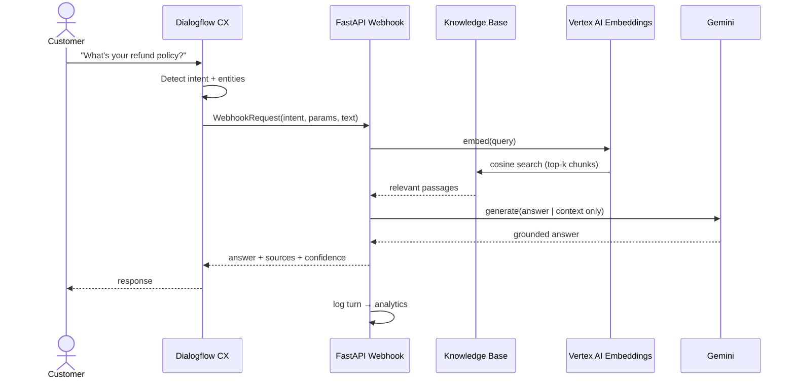
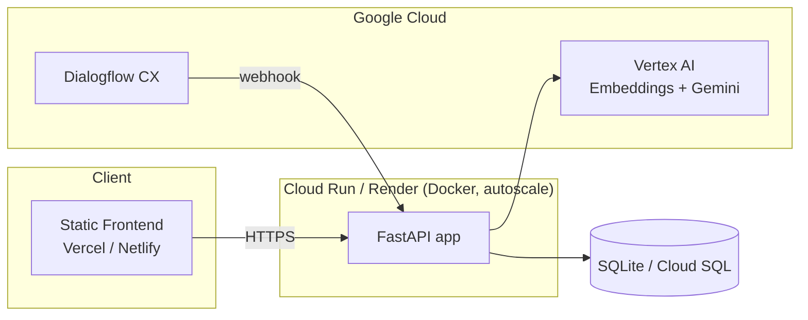
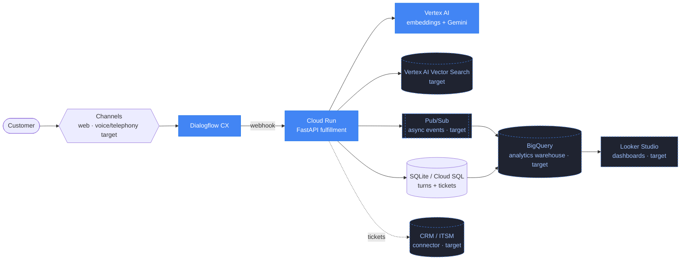

# Architecture Diagrams

Enterprise-style diagrams rendered with **Mermaid** (renders natively on GitHub —
no image files to maintain). For prose detail see
[solution-architecture.md](solution-architecture.md) and
[architecture.md](architecture.md).

## System flow

## Request sequence (one grounded turn)

## Deployment topology (current)

## Target production architecture (Google Cloud)

The same code scales onto a full Google Cloud Contact Center AI stack. New pieces
vs. the current build are marked **(target)**.

- **Pub/Sub** decouples slow work (ticket creation, CRM sync, transcript export)
  from the synchronous webhook path.
- **BigQuery** is the analytics warehouse for conversation logs → **Looker Studio**
  dashboards (the in-app dashboard is the lightweight version of this).
- **Vertex AI Vector Search** replaces the in-memory cosine index for large KBs.
- **Voice** via the CCAI telephony connector — see
  [customer-journey-design.md](customer-journey-design.md#voice--contact-center-ai).
