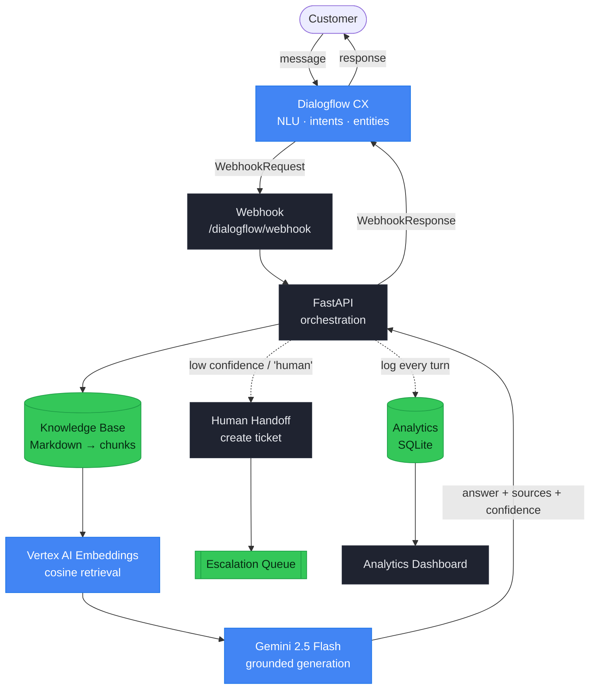
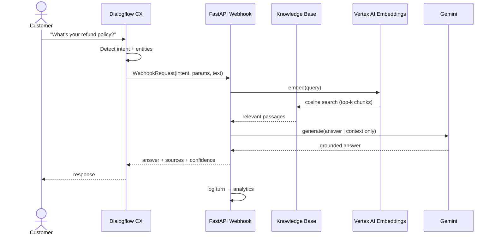
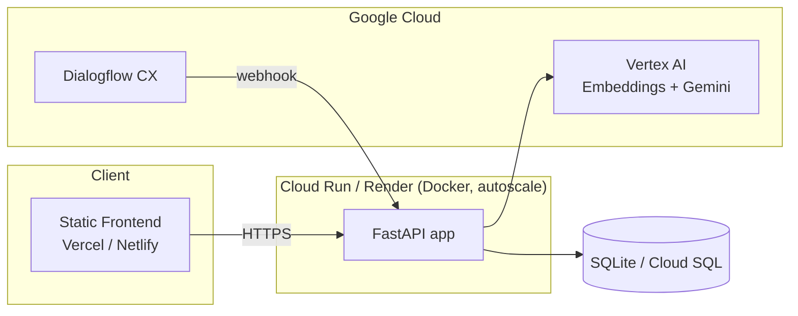

# Architecture Diagrams

Enterprise-style diagrams rendered with **Mermaid** (renders natively on GitHub —
no image files to maintain). For prose detail see
[solution-architecture.md](solution-architecture.md) and
[architecture.md](architecture.md).

## System flow

## Request sequence (one grounded turn)

## Deployment topology

